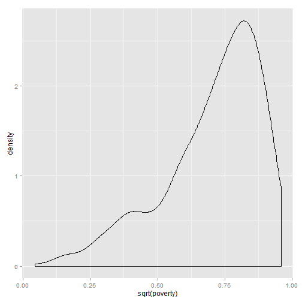
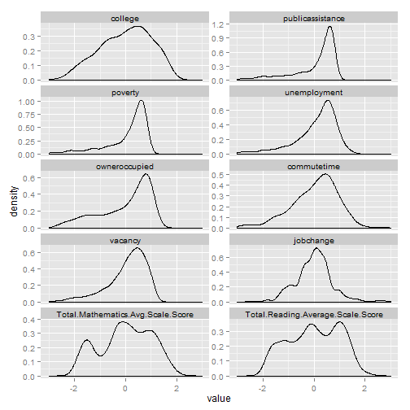
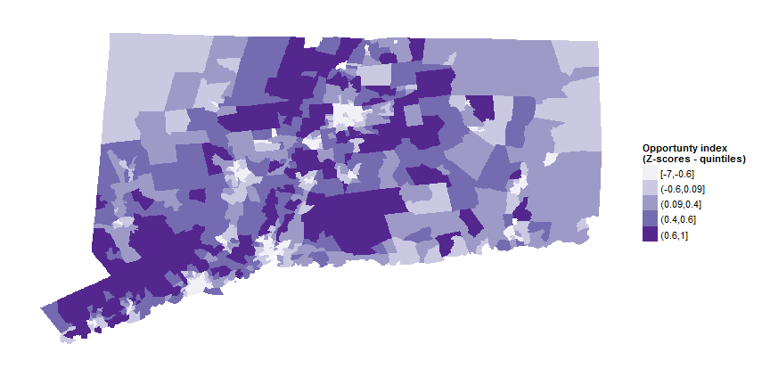
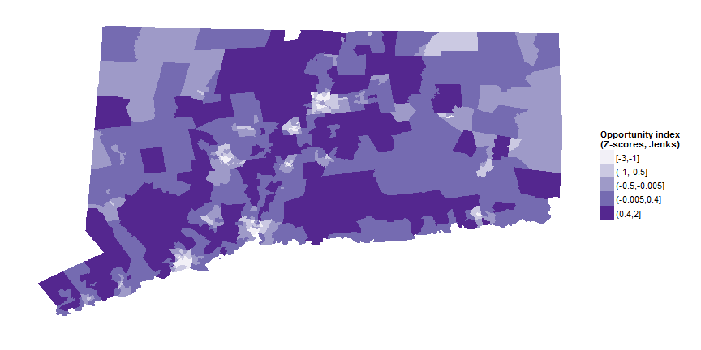
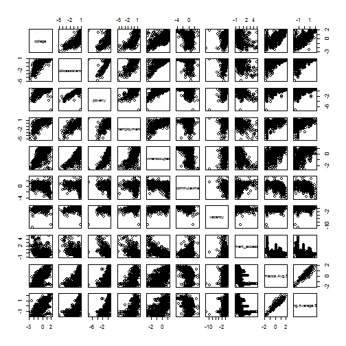
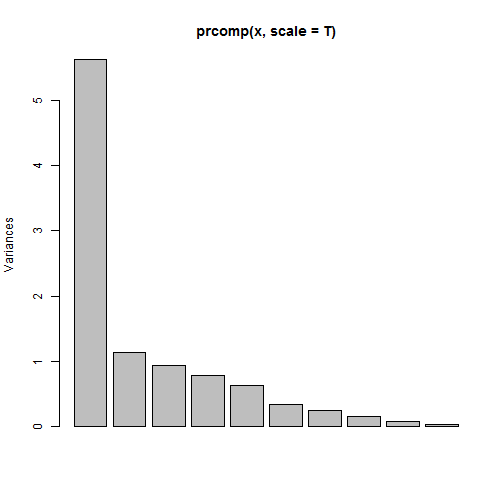
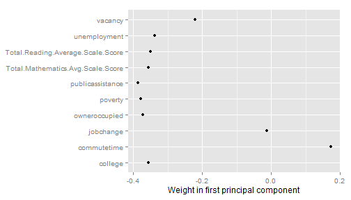
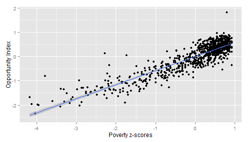

## Opportunity Index

If you just want to download the data, you can get it [here](https://github.com/sgaul/opportunity/blob/gh-pages/oppdata.csv).

The [Opportunity Index](http://kirwaninstitute.osu.edu/reports/2009/11_2009_CTOppMapping_FullReport.pdf) uses 10 variables; seven of these can be retrieved from the Census Bureau's American Community Survey:
* [Educational attainment for the population](http://factfinder2.census.gov/faces/tableservices/jsf/pages/productview.xhtml?pid=ACS_11_5YR_B23006) (college and associates degrees)
* [Unemployment rates](http://factfinder2.census.gov/faces/tableservices/jsf/pages/productview.xhtml?pid=ACS_12_5YR_B23025) (percent in labor force but unemployed)
* [Population on public assistance](http://factfinder2.census.gov/faces/tableservices/jsf/pages/productview.xhtml?pid=ACS_11_5YR_B19058)
* [Mean commute time](http://factfinder2.census.gov/faces/tableservices/jsf/pages/productview.xhtml?pid=ACS_12_5YR_B08135) (average time to commute for residents, using the method outlined [here](http://quickfacts.census.gov/qfd/meta/long_LFE305212.htm))
* [Vacancy rate](http://factfinder2.census.gov/faces/tableservices/jsf/pages/productview.xhtml?pid=ACS_12_5YR_B25002) (percent vacant housing)
* [Poverty](http://factfinder2.census.gov/faces/tableservices/jsf/pages/productview.xhtml?pid=ACS_12_5YR_B17017) (percent below poverty line)
* [Home ownership rate](http://factfinder2.census.gov/faces/tableservices/jsf/pages/productview.xhtml)

### Census data for neighborhoods

For 'neighborhood' data, the index uses census tracts which restricts the data source to the ACS 5-year estimates. I used the [acs.R package](http://cran.r-project.org/web/packages/acs/index.html) to download census data by tract for the entire state for each of these seven variables. The most recent set of 5-year estimates spans 2008 - 2012, but the script could be updated for different years as new data becomes available.

To keep each of the variables in the same 'direction' (more homeownership is 'good,' while more poverty is 'bad'), I converted the public assistance, poverty, unemployment and vacancy to the inverse percentage (i.e. 1 - rate). For the commute times, I multiplied by (-1) so that longer commute times are lower values. 

Below are summary stats for the census data components of the index:


```
##     college      publicassistance    poverty       unemployment  
##  Min.   :0.142   Min.   :0.202    Min.   :0.000   Min.   :0.615  
##  1st Qu.:0.517   1st Qu.:0.849    1st Qu.:0.860   1st Qu.:0.890  
##  Median :0.666   Median :0.944    Median :0.936   Median :0.926  
##  Mean   :0.646   Mean   :0.884    Mean   :0.890   Mean   :0.910  
##  3rd Qu.:0.780   3rd Qu.:0.974    3rd Qu.:0.967   3rd Qu.:0.945  
##  Max.   :1.000   Max.   :1.000    Max.   :1.000   Max.   :1.000  
##  NA's   :5       NA's   :7        NA's   :7       NA's   :7      
##  owneroccupied    commutetime        vacancy     
##  Min.   :0.000   Min.   :-45.34   Min.   :0.000  
##  1st Qu.:0.527   1st Qu.:-27.44   1st Qu.:0.885  
##  Median :0.793   Median :-23.95   Median :0.930  
##  Mean   :0.692   Mean   :-24.77   Mean   :0.911  
##  3rd Qu.:0.907   3rd Qu.:-21.59   3rd Qu.:0.959  
##  Max.   :1.000   Max.   : -8.41   Max.   :1.000  
##  NA's   :7       NA's   :8        NA's   :6
```


The remaining variables - math and reading test scores and economic climate - aren't publicly available at the neighborhood level. 

### Town data for jobs and test scores

Math and reading scores are reported by the State Department of Education [at the school and district level](http://www.ctreports.com/). Since many children do not attend neighborhood schools, even if data were readily available it may  not accurately represent opportunity in a particular neighborhood. As a proxy, I used the average test scores for the school district of the town. Average test scores take into account the performance of all students, not just those crossing a particular threshold. The index also does not specify the grade level, so I opted to take 3rd grade reading and math scores as a fairly common milestone indicator. 

A few smaller districts did not have 2013 reports, so the most recent year available was used instead. Cornwall and Union did not have data for any of the past seven years. Scores for regional school districts are reported for each town in the region. 

'Economic climate' was defined for the Opportunity Index as 'the change in jobs within 5 miles from 2005 to 2008,' using data from ESRI Business Analyst. To get around relying on data from ESRI, I used the [Quarterly Census of Earnings and Wages](http://www1.ctdol.state.ct.us/lmi/) series from the Bureau of Labor Statistics. The data is available by town and is a direct census of employment from wage records. I used 2009 to 2012 as the timeframe, although this does not perfectly match the census data. 

As in the prior Opportunity Index, the job change data has some outlier values, particularly for small towns (such as Barkhamsted, where employment doubled from 616 to 1145 people over the three years) which you can see in the summary stats below.


```
##    jobchange      Total.Mathematics.Avg.Scale.Score
##  Min.   :-0.367   Min.   :212                      
##  1st Qu.:-0.011   1st Qu.:239                      
##  Median : 0.013   Median :255                      
##  Mean   : 0.012   Mean   :254                      
##  3rd Qu.: 0.034   3rd Qu.:271                      
##  Max.   : 0.858   Max.   :298                      
##  NA's   :6        NA's   :7                        
##  Total.Reading.Average.Scale.Score
##  Min.   :208                      
##  1st Qu.:228                      
##  Median :240                      
##  Mean   :241                      
##  3rd Qu.:257                      
##  Max.   :279                      
##  NA's   :8
```


### Calculating z-scores for the index

The Opportunity Index uses z-scores to scale the variables and calculate the index. This is important because the interpretation of the z-scores depends on how the data are distributed. If data are distributed normally ('bell-curve' style), the z-scores tell us roughly how much of the data is below or above a certain z-score. You can then also compare z-scores for different bell-curve-shaped data sets - the z-scores mean the same thing if the underlying distributions have the same shape. 

The plots below show the distribution of each of the components of the index for the 833 census tracts in Connecticut. You can see that most are not bell-curve shaped. Rather, several are skewed, which reflects the general concentration of poverty, public assistance and related variables in a small set of neighborhoods within the state. 

 


If the data are not normally distributed - if, for instance, they are skewed or there are multiple modes in the data - then the z-scores can be harder to interpret. And it's also harder to compare the z-scores across variables - a z-score of 2 for poverty doesn't mean the same thing as a z-score of 2 for commute time if they don't have the same-shaped distribution. 

This matters since the opportunity index is calculated using the average z-scores across all of the variables. If the variables have different distributions, then the z-scores will have different ranges and the z-scores won't have the same interpretation or influence on the final index values. 

The charts below show the standardized results for each variable - they report the z-scores between -/+2 standard deviations for each variable. You can see that variables like poverty, public assistance, unemployment tend to have similar shapes and are skewed positive - there are many above-average tracts, but a long tail of tracts with below-average scores on these variables.

 


To see this visually, we can map each of the variables for the state. Several variables - like poverty, public assistance, unemployment - show similar patterns across tracts, while job growth and commute times are less similar. 

 


The next step is to calculate the opportunity index as the average of the z-scores of the individual variables. 

Even this has some choices involved - the Kirwan Institute mapping uses [quintiles to color the maps](http://kirwaninstitute.osu.edu/reports/2009/11_2009_CTOppMapping_FullReport.pdf), which means 1/5th of the tracts will fall into each color category. The map below shows the updated index for the state using quintiles. 

 


Another way of coloring the map would be to use [Jenks natural breaks](http://support.esri.com/en/knowledgebase/GISDictionary/term/natural%20breaks%20classification) method which looks for natural divisions in the data. The map below uses this coloring method for the same data.

 


This map reflects fewer areas of 'very low' opportunity, but more areas of 'low' and 'moderate' opportunity. Another way to see this is to plot the distribution of the index values for the tracts, including the breakpoints. The chart below shows the breakpoints using the quintiles. (Again, the overall distribution is skewed positive.)

 


And this chart shows the breakpoints using the natural breaks method. 

 


Using quintiles means that roughly 20 percent of the population will always live in high opportunity areas (since census tracts have roughly similar population), while the natural breaks (or other methods) would reflect the concentration of poverty in a smaller set of areas. 

### What is driving the Opportunity Index?

With a composite index of z-scores, it helps to see if specific variables are playing more of a role in determining the final index values. The [OECD guide to composite indicators](http://www.oecd.org/std/42495745.pdf) notes that using z-scores means that 'indicators with extreme values thus have a greater effect on the composite indicator.' That can be an issue in a state with a high degree of inequality and concentration of poverty. 

As a start, we know that many of the variables are correlated with each other - the correlation matrix below shows that several of the variables - poverty, public assistance, etc. - are correlated with each other. Job growth has almost no correlation with any of the variables. 


```
##                                   college publicassistance poverty
## college                              1.00             0.77    0.66
## publicassistance                     0.77             1.00    0.88
## poverty                              0.66             0.88    1.00
## unemployment                         0.69             0.81    0.73
## owneroccupied                        0.66             0.81    0.84
## commutetime                         -0.34            -0.26   -0.29
## vacancy                              0.31             0.45    0.56
## jobchange                            0.05             0.02    0.01
## Total.Mathematics.Avg.Scale.Score    0.70             0.67    0.64
## Total.Reading.Average.Scale.Score    0.70             0.65    0.62
##                                   unemployment owneroccupied commutetime
## college                                   0.69          0.66       -0.34
## publicassistance                          0.81          0.81       -0.26
## poverty                                   0.73          0.84       -0.29
## unemployment                              1.00          0.65       -0.14
## owneroccupied                             0.65          1.00       -0.39
## commutetime                              -0.14         -0.39        1.00
## vacancy                                   0.36          0.49       -0.09
## jobchange                                -0.03          0.00       -0.08
## Total.Mathematics.Avg.Scale.Score         0.54          0.66       -0.37
## Total.Reading.Average.Scale.Score         0.53          0.64       -0.37
##                                   vacancy jobchange
## college                              0.31      0.05
## publicassistance                     0.45      0.02
## poverty                              0.56      0.01
## unemployment                         0.36     -0.03
## owneroccupied                        0.49      0.00
## commutetime                         -0.09     -0.08
## vacancy                              1.00     -0.02
## jobchange                           -0.02      1.00
## Total.Mathematics.Avg.Scale.Score    0.32      0.03
## Total.Reading.Average.Scale.Score    0.29      0.05
##                                   Total.Mathematics.Avg.Scale.Score
## college                                                        0.70
## publicassistance                                               0.67
## poverty                                                        0.64
## unemployment                                                   0.54
## owneroccupied                                                  0.66
## commutetime                                                   -0.37
## vacancy                                                        0.32
## jobchange                                                      0.03
## Total.Mathematics.Avg.Scale.Score                              1.00
## Total.Reading.Average.Scale.Score                              0.96
##                                   Total.Reading.Average.Scale.Score
## college                                                        0.70
## publicassistance                                               0.65
## poverty                                                        0.62
## unemployment                                                   0.53
## owneroccupied                                                  0.64
## commutetime                                                   -0.37
## vacancy                                                        0.29
## jobchange                                                      0.05
## Total.Mathematics.Avg.Scale.Score                              0.96
## Total.Reading.Average.Scale.Score                              1.00
```


A scatterplot matrix shows the same visually - job growth and (to a lesser extent) commute time have little obvious relationship with the other variables.

 


Principal components analysis is another way to see the key factors that determine the final index. A principal components analysis of the index data shows that the first principal component dominates the results - explaining 56 percent of the overall variance in the data (first bar in the graph, first column in the table). 


```
## Importance of components:
##                          PC1   PC2    PC3    PC4    PC5    PC6    PC7
## Standard deviation     2.372 1.070 0.9723 0.8904 0.7957 0.5817 0.4936
## Proportion of Variance 0.563 0.114 0.0945 0.0793 0.0633 0.0338 0.0244
## Cumulative Proportion  0.563 0.677 0.7716 0.8509 0.9142 0.9481 0.9725
##                           PC8     PC9    PC10
## Standard deviation     0.3927 0.29275 0.18870
## Proportion of Variance 0.0154 0.00857 0.00356
## Cumulative Proportion  0.9879 0.99644 1.00000
```

 


We can look at the weights for each of the variables in the first principal component in the chart below. This shows that job growth has little influence on the first component (weight close to 0), while commute time offsets some of the other variables (positive weight). Poverty, public assistance and owner-occupied housing have the strongest weights. 

 


In other words: since much of the variance is explained by the first principal component and since poverty, public assistance, owner-occupied housing, educational attainment, test scores and unemployment have the most weight for that component, most of the opportunity index is described by these variables (poverty, public assistance, etc.). 

Not surprisingly, many of these variables also have very skewed distributions across Connecticut neighborhoods, and hence a more extreme range of z-scores to factor into the overall index.

Another way to look at this is to see how well these variables predict the final index values. For example, poverty alone predicts the overall index pretty well - the R-squared is 0.78 - meaning that the variation in poverty alone explains 78% of the variation in opportunity. 

 


Overall: 
* We can re-calculate the opportunity index using Census data and state data for towns on test scores and jobs, making some concessions for data availability on the latter variables.
* Timing is a consideration - the Census data covers a different time horizon than the other variables. (But the original index used 2000 census data and jobs data for 2005 - 2008, so this may be less of a concern.)
* The index is driven largely by poverty and variables like public assistance that are strongly correlated with poverty. 
* Different ways to display the data will yield different conclusions about the landscape of opportunity in Connecticut. 
* Job growth (economic climate) has the least influence on the index as it is uncorrelated with the other variables. 

